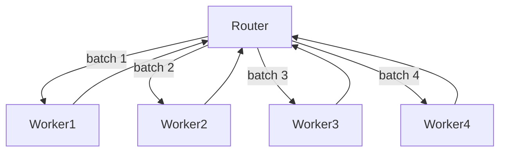
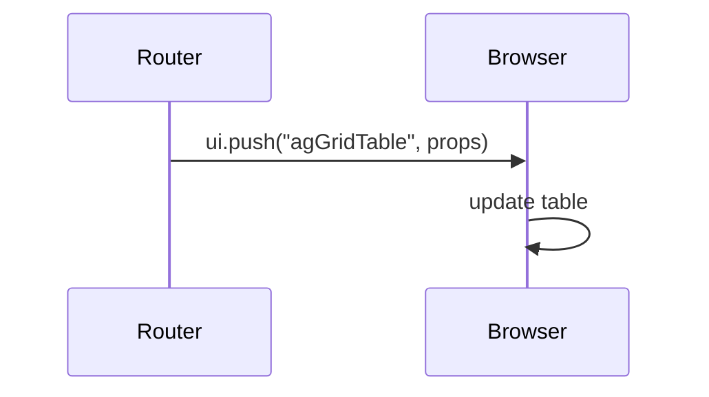

# Open Websets

This repository provides a Next.js based interface and several LangGraph agents written in TypeScript.

## Project structure

- `frontend/` – web client built with Next.js
- `langgraph/` – reusable LangGraph agents
- `documentations/` – crawled markdown documentation (read‑only)

## Setup

Install dependencies for a package before running commands:

```bash
cd frontend && npm install
```

For the LangGraph agents:

```bash
cd langgraph && npm install
yarn install
```

Install the LangGraph CLI using npx from the LangGraph folder:

```bash
cd langgraph && npx @langchain/langgraph-cli
```

## Running

Start the development server for the frontend with:

```bash
cd frontend
npm run dev
```

Preview the LangGraph agents with:

```bash
cd langgraph
npx @langchain/langgraph-cli@latest dev
```

## Design Thinking

Open Websets takes a worker-pool approach to speed up entity qualification and deliver a responsive interface. A router node splits the list of entities into batches and dispatches up to four agents in parallel. As each agent finishes, the router launches another until every entity is processed.



While the agents work, the backend streams UI messages that update a table on the frontend. Each completed batch triggers a new message so users see results appear in real time.



This design keeps the qualification agents busy and the user interface fresh as soon as data is available.
