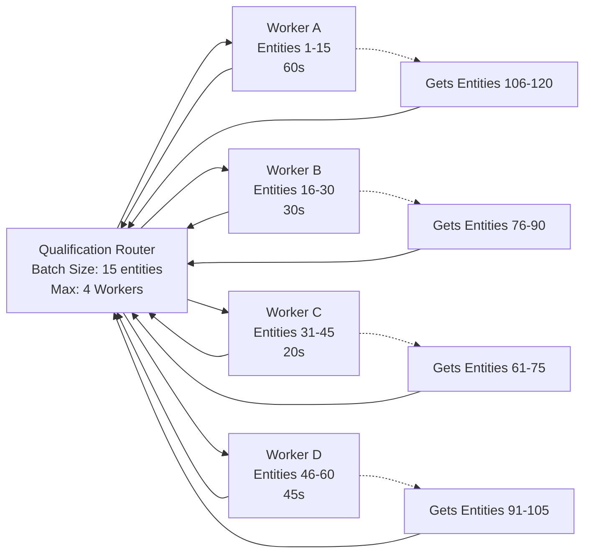
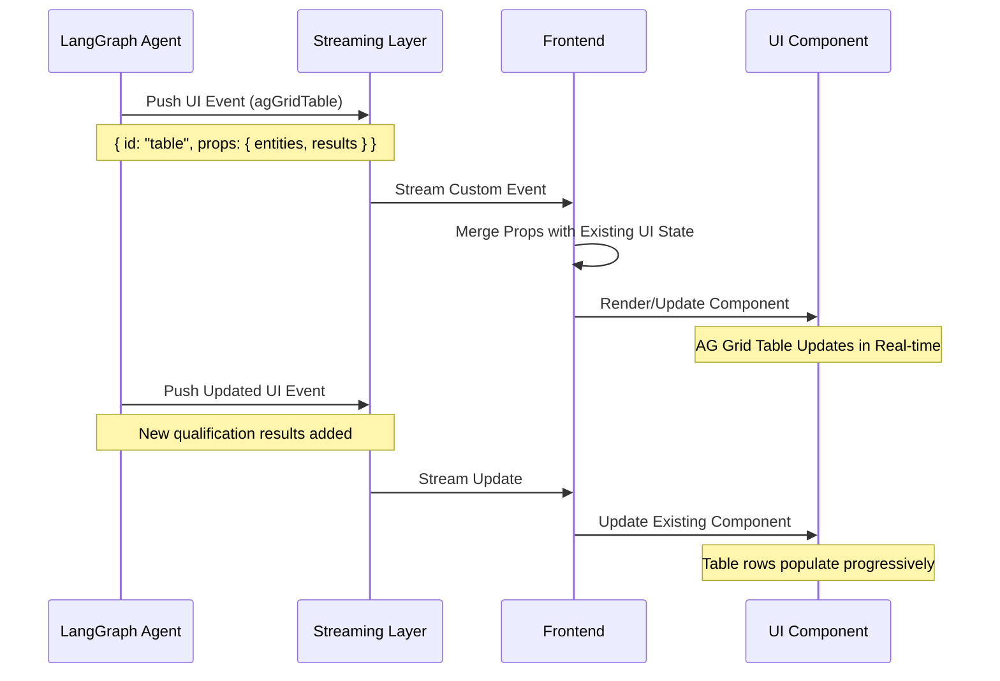

# Open Websets

[![DeepWiki](https://img.shields.io/badge/DeepWiki-jzhang17%2Fopen--websets-blue.svg?logo=data:image/png;base64,iVBORw0KGgoAAAANSUhEUgAAACwAAAAyCAYAAAAnWDnqAAAAAXNSR0IArs4c6QAAA05JREFUaEPtmUtyEzEQhtWTQyQLHNak2AB7ZnyXZMEjXMGeK/AIi+QuHrMnbChYY7MIh8g01fJoopFb0uhhEqqcbWTp06/uv1saEDv4O3n3dV60RfP947Mm9/SQc0ICFQgzfc4CYZoTPAswgSJCCUJUnAAoRHOAUOcATwbmVLWdGoH//PB8mnKqScAhsD0kYP3j/Yt5LPQe2KvcXmGvRHcDnpxfL2zOYJ1mFwrryWTz0advv1Ut4CJgf5uhDuDj5eUcAUoahrdY/56ebRWeraTjMt/00Sh3UDtjgHtQNHwcRGOC98BJEAEymycmYcWwOprTgcB6VZ5JK5TAJ+fXGLBm3FDAmn6oPPjR4rKCAoJCal2eAiQp2x0vxTPB3ALO2CRkwmDy5WohzBDwSEFKRwPbknEggCPB/imwrycgxX2NzoMCHhPkDwqYMr9tRcP5qNrMZHkVnOjRMWwLCcr8ohBVb1OMjxLwGCvjTikrsBOiA6fNyCrm8V1rP93iVPpwaE+gO0SsWmPiXB+jikdf6SizrT5qKasx5j8ABbHpFTx+vFXp9EnYQmLx02h1QTTrl6eDqxLnGjporxl3NL3agEvXdT0WmEost648sQOYAeJS9Q7bfUVoMGnjo4AZdUMQku50McDcMWcBPvr0SzbTAFDfvJqwLzgxwATnCgnp4wDl6Aa+Ax283gghmj+vj7feE2KBBRMW3FzOpLOADl0Isb5587h/U4gGvkt5v60Z1VLG8BhYjbzRwyQZemwAd6cCR5/XFWLYZRIMpX39AR0tjaGGiGzLVyhse5C9RKC6ai42ppWPKiBagOvaYk8lO7DajerabOZP46Lby5wKjw1HCRx7p9sVMOWGzb/vA1hwiWc6jm3MvQDTogQkiqIhJV0nBQBTU+3okKCFDy9WwferkHjtxib7t3xIUQtHxnIwtx4mpg26/HfwVNVDb4oI9RHmx5WGelRVlrtiw43zboCLaxv46AZeB3IlTkwouebTr1y2NjSpHz68WNFjHvupy3q8TFn3Hos2IAk4Ju5dCo8B3wP7VPr/FGaKiG+T+v+TQqIrOqMTL1VdWV1DdmcbO8KXBz6esmYWYKPwDL5b5FA1a0hwapHiom0r/cKaoqr+27/XcrS5UwSMbQAAAABJRU5ErkJggg==)](https://deepwiki.com/jzhang17/open-websets)
<!-- DeepWiki badge generated by https://deepwiki.ryoppippi.com/ -->


This repository provides a Next.js based interface and several LangGraph agents written in TypeScript.

## Project structure

- `frontend/` – web client built with Next.js
- `langgraph/` – reusable LangGraph agents
- `documentations/` – crawled markdown documentation (read‑only)

## Setup

Install dependencies for a package before running commands:

```bash
cd frontend && npm install
```

For the LangGraph agents:

```bash
cd langgraph && npm install
yarn install
```

Install the LangGraph CLI using npx from the LangGraph folder:

```bash
cd langgraph && npx @langchain/langgraph-cli
```
## Running

Start the development server for the frontend with:

```bash
cd frontend
npm run dev
```

Preview the LangGraph agents with:

```bash
cd langgraph
npx @langchain/langgraph-cli@latest dev
```

## Design Thinking

Open Websets implements two architectural patterns enabled by LangGraph's capabilities: **concurrency fan-out mechanisms** and **generative UI components**. These patterns leverage LangGraph's built-in support for parallel processing and streaming to handle large datasets while providing real-time user interfaces.

### Concurrency Fan-Out Architecture

Our system utilizes LangGraph's `Send` API and subgraph functionality to distribute entity qualification tasks across multiple concurrent agents. This implementation follows LangGraph's recommended patterns for parallel processing.



**Implementation Details**: The qualification router leverages LangGraph's `Send` primitive to spawn multiple `entityQualification` subgraphs concurrently. Each subgraph processes a batch of 15 entities independently. The router maintains state tracking (`dispatchedBatches`, `finishedBatches`) to manage a pool of up to 4 concurrent workers.

**Technical Benefits**:
- **Parallel Execution**: LangGraph's async task handling enables true concurrent processing
- **State Management**: Shared state updates coordinate worker completion and results aggregation  
- **Automatic Scheduling**: Router logic dispatches new batches as workers become available
- **Batched Processing**: Reduces overhead while maintaining manageable concurrency limits

### Generative UI Components

This system implements LangGraph's streaming UI capabilities to generate interface components dynamically. The backend pushes structured UI events that the frontend renders in real-time using LangGraph's React SDK.



**Technical Implementation**:
1. **Backend Events**: Agents use LangGraph's `typedUi` helper to emit structured UI messages with stable IDs
2. **Streaming Protocol**: Events flow through LangGraph's streaming infrastructure to the frontend
3. **React Integration**: Frontend uses LangGraph's `useStream` hook and `LoadExternalComponent` utility
4. **State Merging**: UI messages with matching IDs merge props automatically, enabling live updates

**LangGraph Integration**: These patterns directly utilize LangGraph's core features - the parallel processing capabilities handle concurrency while the streaming UI system manages real-time interface updates. The framework's design makes it straightforward to implement both patterns without custom infrastructure.

**Results**: Users see qualification progress in real-time through automatically updating tables, with no manual intervention required. The system processes large entity lists efficiently by parallelizing work across multiple agents while maintaining responsive UI feedback throughout the process.

